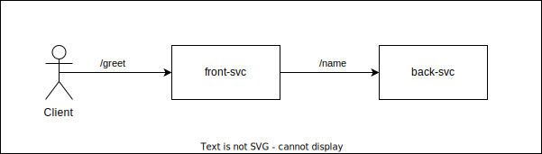

# Multi Services Example

This is a simple example of how instrumenting multiple services.

There are 2 services in this example:

- `front-svc` => the front service receiving requests from the client
- `back-svc` => the service that is being called by `front-svc` (hence named `back`)



All traces will be collected in [Jaeger](https://www.jaegertracing.io/), and metrics will be collected in [Prometheus](https://prometheus.io/).

## Observability Components

This example demonstrates a complete observability setup with:

- **Distributed Tracing**: Using Jaeger to collect and visualize distributed traces across services
- **Metrics**: Using Prometheus to collect and monitor metrics from both services
- **Visualization**: 
  - Jaeger UI for trace visualization (`http://localhost:16686`)
  - Prometheus UI for metrics querying and visualization (`http://localhost:9090`)

## How to Run

Make sure to have Docker & Docker Compose installed in your system. After that run this command:

```
> make run
```

If the command runs successfully (it will take a moment), you will see something like this in the terminal:

```
back-svc_1   | 2022/07/23 01:49:29 back service is listening on :8091
front-svc_1  | 2022/07/23 01:49:26 front service is listening on :8090
...
multi-services_client_1 exited with code 0
```

Open your browser and access `http://localhost:16686` to access the Jaeger UI.

You should see some traces available already in the UI.
